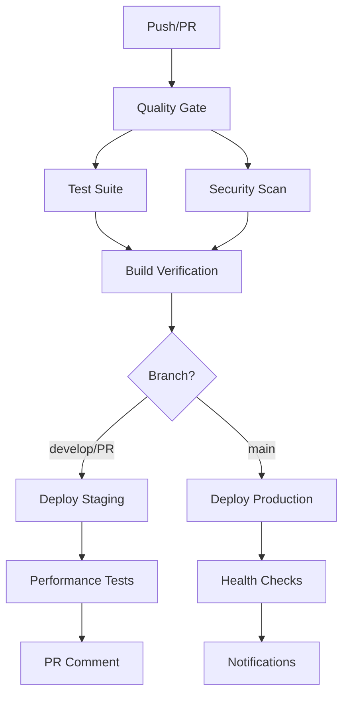

# 🚀 Quality Neighbor CI/CD Pipeline

## Overview

This directory contains the complete CI/CD pipeline for the Quality Neighbor monorepo, implementing automated testing, security scanning, and deployment workflows.

## 🏗️ Workflow Architecture



## 📋 Workflows

### 1. Main CI Pipeline (`ci.yml`)
**Triggers**: Push to main/develop, Pull Requests
**Purpose**: Comprehensive validation of code changes

**Jobs**:
- **Quality Gate**: Linting, type checking, formatting, security audit
- **Test Suite**: Unit, integration, and E2E tests with coverage
- **Build Verification**: Builds all applications in parallel
- **Security Scanning**: SAST, dependency scanning, secret detection
- **Performance Monitoring**: Lighthouse audits and bundle analysis

### 2. Security Scanning (`security.yml`)
**Triggers**: Weekly schedule, Push to main, Pull Requests
**Purpose**: Comprehensive security analysis

**Features**:
- Dependency vulnerability scanning
- Secret detection with TruffleHog
- SAST with Semgrep
- License compliance checking
- Container security (when applicable)

### 3. Staging Deployment (`deploy-staging.yml`)
**Triggers**: Push to develop, Pull Requests
**Purpose**: Automated staging deployments with testing

**Features**:
- Multi-app deployment strategy
- Smoke testing and health checks
- Lighthouse performance audits
- PR preview comments
- Database migration support

### 4. Production Deployment (`deploy-production.yml`)
**Triggers**: Push to main, Manual dispatch
**Purpose**: Safe production deployments with rollback

**Features**:
- Pre-deployment validation
- Database backup and migration
- Blue-green deployment strategy
- Comprehensive health checks
- Automatic rollback on failure
- Slack notifications

### 5. Release Management (`release.yml`)
**Triggers**: Version tags, Manual dispatch
**Purpose**: Automated release creation and deployment

**Features**:
- Semantic versioning
- Automated changelog generation
- Build artifact creation
- GitHub release publishing
- Multi-channel notifications

## 🔧 Configuration

### Environment Variables

#### Required Secrets
```bash
# Vercel Deployment
VERCEL_TOKEN=your_vercel_token
VERCEL_ORG_ID=your_org_id
VERCEL_PROJECT_ID_QN_PLATFORM=platform_project_id
VERCEL_PROJECT_ID_QN_DASHBOARD=dashboard_project_id
VERCEL_PROJECT_ID_QN_BUSINESS=business_project_id

# Supabase
SUPABASE_ACCESS_TOKEN=your_supabase_token
SUPABASE_PROJECT_REF=your_project_ref
SUPABASE_ACCESS_TOKEN_STAGING=staging_token
SUPABASE_PROJECT_REF_STAGING=staging_ref

# Security Scanning
SNYK_TOKEN=your_snyk_token
CODECOV_TOKEN=your_codecov_token

# Notifications
SLACK_WEBHOOK=your_slack_webhook
EMAIL_USERNAME=your_email
EMAIL_PASSWORD=your_email_password
RELEASE_NOTIFICATION_EMAIL=team@qualityneighbor.com

# Performance
TURBO_TOKEN=your_turbo_token
TURBO_TEAM=your_turbo_team
```

#### Optional Secrets
```bash
# GitHub Token (auto-provided)
GITHUB_TOKEN=auto_generated

# Additional integrations
LIGHTHOUSE_TOKEN=your_lighthouse_token
```

### Package Scripts

Each application must implement these scripts:

```json
{
  "scripts": {
    "dev": "Development server",
    "build": "Production build",
    "start": "Start production server",
    "lint": "Code linting",
    "type-check": "TypeScript validation",
    "test": "All tests",
    "test:unit": "Unit tests only",
    "test:integration": "Integration tests",
    "test:e2e": "End-to-end tests",
    "test:critical": "Critical path tests",
    "test:smoke": "Smoke tests",
    "test:health": "Health checks",
    "clean": "Clean build artifacts",
    "deploy": "Deploy to production"
  }
}
```

## 🧪 Testing Strategy

### Test Types
1. **Unit Tests**: Component and function testing
2. **Integration Tests**: API and database integration
3. **E2E Tests**: Full user journey testing
4. **Critical Tests**: Core functionality validation
5. **Smoke Tests**: Basic deployment validation
6. **Health Checks**: Production monitoring

### Coverage Requirements
- **Unit Tests**: 80% minimum coverage
- **Integration Tests**: Critical paths covered
- **E2E Tests**: Main user flows
- **Performance**: Lighthouse scores > 80

## 🔒 Security Measures

### Automated Scanning
- **Semgrep**: SAST for code vulnerabilities
- **Snyk**: Dependency vulnerability scanning
- **TruffleHog**: Secret detection
- **License Check**: Open source compliance

### Security Policies
- High/Critical vulnerabilities block deployment
- Secrets must not be committed to repository
- All dependencies scanned weekly
- Security patches applied automatically

## 📊 Performance Monitoring

### Lighthouse Audits
- **Staging**: Warning thresholds (80+ scores)
- **Production**: Error thresholds (85+ scores)
- **Metrics**: FCP, LCP, CLS tracking

### Bundle Analysis
- Size limit enforcement
- Dependency analysis
- Performance regression detection

## 🚀 Deployment Strategy

### Environments
1. **Development**: Local development
2. **Staging**: Feature testing and validation
3. **Production**: Live user environment

### Deployment Flow
```
Feature Branch → PR → Staging → Review → Main → Production
```

### Rollback Strategy
- Automatic rollback on health check failure
- Manual rollback capability
- Database backup before migrations
- Vercel deployment history

## 📢 Notifications

### Slack Channels
- `#quality-neighbor-deployments`: Successful deployments
- `#quality-neighbor-alerts`: Failures and issues
- `#quality-neighbor-releases`: New releases

### Email Notifications
- Release announcements
- Critical failure alerts
- Weekly security reports

## 🛠️ Maintenance

### Weekly Tasks
- Review security scan results
- Update dependencies
- Monitor performance metrics
- Clean up old artifacts

### Monthly Tasks
- Review and update CI/CD workflows
- Performance optimization
- Security policy updates
- Dependency audit

## 📚 Resources

- [GitHub Actions Documentation](https://docs.github.com/en/actions)
- [Vercel Deployment Guide](https://vercel.com/docs)
- [Supabase CLI Reference](https://supabase.com/docs/reference/cli)
- [Lighthouse CI](https://github.com/GoogleChrome/lighthouse-ci)
- [Turborepo Documentation](https://turbo.build/repo/docs)

---

**Last Updated**: 2025-01-19
**Maintained By**: Quality Neighbor DevOps Team