```mermaid
flowchart TD
    A[Strategic Considerations] --> B[Network Effects]
    A --> C[Competitive Strategy]
    A --> D[Business Sustainability]
    A --> E[Expansion Strategy]
    A --> F[Technical Architecture]
    A --> G[Revenue Diversification]
    A --> H[Risk Mitigation]
    
    B --> B1[Feature Viability Thresholds]
    B --> B2[User Retention]
    
    C --> C1[Content Relevance vs. Scale]
    C --> C2[Nextdoor Weaknesses]
    
    D --> D1[Time to Revenue]
    D --> D2[Investor Considerations]
    
    E --> E1[Replicable Blueprint]
    E --> E2[Economies of Scale]
    E --> E3[Regional Network]
    
    F --> F1[Scalable Database Design]
    F --> F2[User Permission Systems]
    F --> F3[Content Distribution]
    
    G --> G1[Premium Features]
    G --> G2[Marketplace Commissions]
    G --> G3[Event Sponsorships]
    G --> G4[Data Insights]
    
    H --> H1[Dependency Risk]
    H --> H2[Competition Risk]
    H --> H3[Economic Fluctuation Risk]
```

Here are some additional relevant and significant considerations for the Quality Neighbor business model:

## Network Effects and Critical Mass

The value of community platforms increases exponentially with user adoption due to network effects. This is particularly important for:

1. **Feature Viability Thresholds** - Many community features have minimum participation requirements to be useful:
   - A tool library with only 5 participants might have 15 tools total
   - A tool library with 500 participants could have 1,500+ tools, dramatically increasing utility

2. **User Retention** - Users will quickly abandon platforms that don't provide immediate value. Starting with a larger population base increases the chance of early positive experiences.

## Competitive Differentiation Strategy

While competing with Nextdoor, your hyper-local focus is a key differentiator, but this doesn't necessarily mean focusing on tiny communities:

1. **Content Relevance vs. Scale** - You can maintain hyper-local relevance within a larger platform through:
   - Neighborhood-specific content channels
   - Location-based filtering of posts/resources
   - Community moderators for each distinct neighborhood

2. **Nextdoor's Weaknesses** - Address these regardless of scale:
   - Excessive negativity (implement positive-only content policies)
   - Irrelevant content (better content categorization and filtering)
   - Privacy concerns (transparent data policies)

## Business Sustainability Timeline

A critical consideration is the runway needed to reach profitability:

1. **Time to Revenue** - Smaller communities require nearly the same upfront investment but generate revenue much more slowly:
   - Hartland Ranch approach: Might take 2-3 years to reach break-even
   - Layered Lockhart approach: Could reach break-even in 12-18 months

2. **Investor Considerations** - If seeking investment, the growth trajectory matters:
   - Investors typically want to see clear paths to substantial growth
   - The layered model provides this growth story while maintaining your core values

## Geographic Expansion Strategy

The layered approach creates a natural expansion model:

1. **Replicable Blueprint** - Perfect the model in Lockhart, then expand to similar-sized communities
2. **Economies of Scale** - Each new community added increases platform value while marginal costs decrease
3. **Regional Network** - Eventually connecting nearby communities creates additional value through regional resource sharing

## Technology Implementation Considerations

The technical architecture should be designed for the layered approach from the beginning:

1. **Scalable Database Design** - Community hierarchies and relationships
2. **User Permission Systems** - Allowing users to participate in multiple community layers
3. **Content Distribution** - Intelligent algorithms for showing relevant content based on proximity and interest

## Revenue Diversification Opportunities

Beyond advertising, a larger user base enables additional revenue streams:

1. **Premium Features** - Optional paid tiers for power users or businesses
2. **Marketplace Commissions** - Small fees on local goods/services transactions
3. **Event Sponsorships** - Community events with business sponsors
4. **Data Insights** - Anonymized community preference data for local businesses (with appropriate privacy controls)

## Long-term Value Creation

The broader approach positions Quality Neighbor for greater long-term value:

1. **Acquisition Potential** - Companies acquiring community platforms value user base size and engagement
2. **Franchise Model** - Your system could become licensable to other communities
3. **Local Commerce Platform** - Evolution into a comprehensive local commerce ecosystem

## Risk Mitigation

The layered approach also reduces several key business risks:

1. **Dependency Risk** - Relying on a single small community makes you vulnerable to any changes in that community
2. **Competition Risk** - Easier to defend a larger territory than a small one if competitors emerge
3. **Economic Fluctuation Risk** - Broader user base provides stability through economic cycles

In summary, while maintaining your core vision of creating a positive, hyper-local community platform, the layered approach starting with all of Lockhart provides significantly better economics, growth potential, and long-term sustainability while still addressing the gaps in existing platforms like Nextdoor.