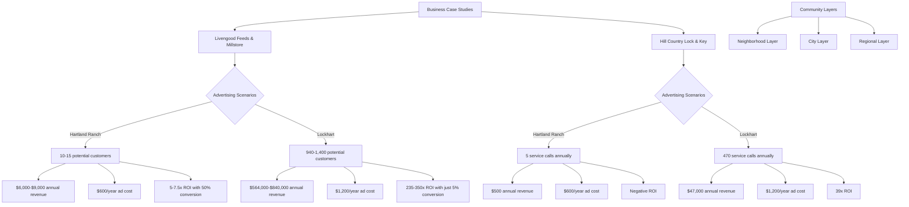

Based on the research I've gathered, I'll now analyze the economics of Quality Neighbor for both the Hartland Ranch-only approach versus the broader Lockhart approach, using real local businesses as examples.

## Real-World Business Case Study: Local Business Economics

### Business Example 1: Livengood Feeds & Millstore

**Business Profile:**
- Located in Lockhart, TX
- Manufactures and sells animal feed for poultry, livestock, wildlife, and equine
- Sells feed by the bag and in bulk loads
- 11-50 employees
- Services both individual pet/livestock owners and commercial farms

**Advertising Scenario Analysis:**

#### Scenario 1: Hartland Ranch Only (50 homes)
- Potential customers in Hartland Ranch: Approximately 10-15 homes with pets/livestock (30% of homes)
- Average feed purchase: $50/month per household
- Potential monthly revenue from Hartland Ranch: $500-$750
- Annual revenue potential: $6,000-$9,000
- Cost of quarterly newsletter ad ($150): $600/year
- ROI if 50% of potential customers convert: 5-7.5x return

#### Scenario 2: All of Lockhart (4,700+ households)
- Potential customers in Lockhart: Approximately 940-1,400 homes with pets/livestock (20-30% of homes)
- Average feed purchase: $50/month per household
- Potential monthly revenue from broader Lockhart area: $47,000-$70,000
- Annual revenue potential: $564,000-$840,000
- Cost of quarterly newsletter ad ($300): $1,200/year
- ROI if just 5% of potential customers convert: 235-350x return

### Business Example 2: Hill Country Lock & Key

**Business Profile:**
- Mobile locksmith service for residential and commercial customers
- Services include key replacement, lockout assistance, lock rekeying
- Average service prices:
  - Car lockout: $40-$120
  - Home lockout: $30-$150
  - Rekeying locks: $22.50-$75 per lock
  - Car key replacement: $120-$580 depending on key type

**Advertising Scenario Analysis:**

#### Scenario 1: Hartland Ranch Only (50 homes)
- Average locksmith services needed: 1 service per 10 homes annually
- Potential service calls from Hartland Ranch: 5 annually
- Average service revenue: $100 per call
- Potential annual revenue: $500
- Cost of quarterly newsletter ad ($150): $600/year
- ROI: Negative return (-$100)

#### Scenario 2: All of Lockhart (4,700+ households)
- Average locksmith services needed: 1 service per 10 homes annually
- Potential service calls from Lockhart: 470 annually
- Average service revenue: $100 per call
- Potential annual revenue: $47,000
- Cost of quarterly newsletter ad ($300): $1,200/year
- ROI: 39x return ($45,800 profit)

## Community Platform Value Proposition

### Hartland Ranch Only (50 homes):
- Tool library participation: ~5-10 households (10-20%)
- Available tools to share: ~15-30 tools
- Skill trading opportunities: Limited by small user base
- Safety checks value: Limited to ~3-5 elderly residents

### All of Lockhart (4,700+ households):
- Tool library participation: ~470-940 households (10-20%)
- Available tools to share: ~1,400-2,800 tools
- Skill trading opportunities: Diverse skill set across larger population
- Safety checks value: Could benefit ~500-700 elderly residents

## Layered Community Approach Analysis

Your idea of keeping communities distinct but layering them is excellent. This creates a model that can:

1. Maintain hyper-local relevance within each neighborhood
2. Allow cross-community engagement for broader resource sharing
3. Create a scalable platform that can expand to additional communities

### Implementation Model:

**Neighborhood Layer:**
- Hartland Ranch has its own dedicated section
- Content and tools specific to this community
- Neighbors can easily connect with immediate neighbors
- HOA-specific announcements and events

**City Layer (Lockhart):**
- Connects all neighborhoods in Lockhart
- Broader tool library and skill sharing
- City-wide events and announcements
- Local business directory and promotions

**Regional Layer:**
- Optional expansion to nearby communities
- Regional events and resources
- Larger marketplace for goods/services

## Economic Viability Analysis

### Cost Structure:
- Platform development: Same cost regardless of user base size
- Content creation: Marginally higher for larger audience
- Marketing/user acquisition: Higher initial cost for larger audience but better economies of scale
- Administration: Similar base cost with incremental increases for larger user base

### Revenue Model:

**For Hartland Ranch Only:**
- Newsletter advertising: $1,800-$3,000/year (3-5 advertisers at $150/quarter)
- Platform sponsorships: Limited potential
- Events: Limited scale and revenue
- Total potential annual revenue: $2,500-$4,000

**For Layered Lockhart Approach:**
- Newsletter advertising: $6,000-$33,000/year (10-15 advertisers at $150-$550/quarter)
- Platform sponsorships: $5,000-$10,000/year from larger businesses
- Events: $2,000-$5,000/year from community events
- Total potential annual revenue: $13,000-$48,000

## Conclusion and Recommendation

Based on the real-world business examples and economic analysis, the data strongly supports expanding beyond Hartland Ranch to include all of Lockhart, while maintaining distinct community layers:

1. **For businesses:** The ROI for advertising is dramatically higher when reaching the entire Lockhart community versus just Hartland Ranch. As demonstrated with Livengood Feeds and Hill Country Lock & Key, the limited customer base in Hartland Ranch alone cannot justify advertising expenses for most businesses.

2. **For residents:** The value of community features like tool libraries and skill trading increases exponentially with more participants. A platform serving only 50 homes would have limited utility compared to one connecting 4,700+ households.

3. **For Quality Neighbor:** The layered approach provides the best of both worlds - maintaining the hyper-local focus that differentiates you from Nextdoor while creating a sustainable business model with growth potential.

The napkin math clearly shows that focusing solely on Hartland Ranch is not economically viable for either Quality Neighbor or the businesses you hope to serve. The layered community model allows you to start with Lockhart as a whole, create distinct neighborhood sections within it (including Hartland Ranch), and build a platform that can eventually expand to additional communities.