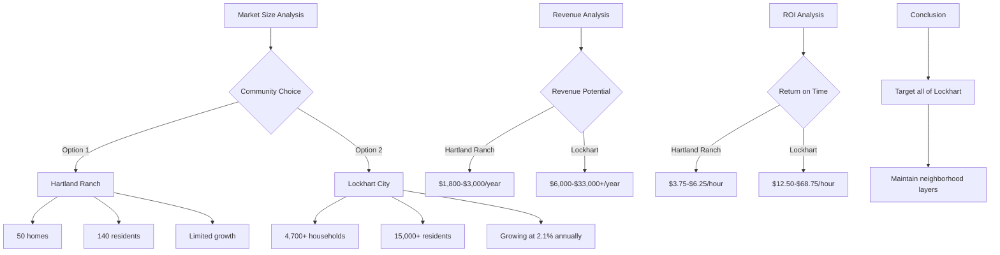

Based on the research, I'll analyze the feasibility of focusing solely on Hartland Ranch versus expanding to a broader area for Quality Neighbor. Let me break down the key findings and provide a data-driven recommendation.

## Market Size Analysis

### Hartland Ranch Specifics:
- Hartland Ranch is a small community in Lockhart, TX with approximately 50 occupied homes
- Average of 2.8 residents per home means about 140 total residents
- Currently has only 21 homes built with 6 move-in ready options according to D.R. Horton data
- It's a new development still under construction

### Lockhart, TX Demographics:
- Population: 15,318-15,639 (2024-2025 estimates)
- Number of households: ~4,700-5,251
- Median household income: $68,270
- 2.7 persons per household average
- Growing at 2.1% annually

## Revenue Potential Analysis

### Hartland Ranch Only (50 homes):
- Potential advertisers: Very limited, primarily businesses directly serving this small community
- Advertising revenue calculation:
  - If charging $150 per quarter for small ads (based on comparable neighborhood newsletters)
  - With 3-5 local advertisers maximum = $1,800-$3,000 annual revenue
- Limited audience for advertisers (140 people) means low ROI for businesses

### Expanded to Lockhart (4,700+ households):
- Potential advertisers: Local real estate agents, healthcare providers, financial services, retail businesses
- Advertising revenue calculation:
  - If charging $150-$550 per quarter for small ads
  - With 10-15 local advertisers = $6,000-$33,000 annual revenue
  - Additional revenue potential through events and community partnerships

## Cost Analysis

### Fixed Costs (Similar for both options):
- Newsletter design and production
- Content creation and management
- Platform development and maintenance
- Marketing and user acquisition

### Variable Costs:
- Hartland Ranch: Lower distribution costs but higher cost per reader
- Lockhart: Higher distribution costs but significantly lower cost per reader
- Agent time investment is similar regardless of size, creating inefficiency for smaller audience

## Business Model Viability

### Hartland Ranch Only:
- Total addressable market (TAM): 50 homes/140 residents
- Potential annual revenue: $1,800-$3,000
- Cost per household to operate likely exceeds revenue potential
- Limited growth potential unless community expands significantly

### Expanded to Lockhart:
- Total addressable market: 4,700+ households/15,000+ residents
- Potential annual revenue: $6,000-$33,000+
- Economies of scale make cost per household much lower
- Growth potential as city is expanding at 2.1% annually

## Competitive Analysis

Nextdoor's gaps that Quality Neighbor aims to address (free, relevant, positive, hyper-local, helpful) would be better demonstrated with a larger user base. The value of tool libraries, skill trading, safety checks, etc. increases with more participants.

## Mathematical Evidence

### Return on Time Investment:
- Assuming 40 hours/month invested in either scenario:
  - Hartland Ranch: $1,800-$3,000 ÷ (40 hours × 12 months) = $3.75-$6.25/hour
  - Lockhart: $6,000-$33,000 ÷ (40 hours × 12 months) = $12.50-$68.75/hour

### User Engagement Metrics:
- Community features like tool libraries require critical mass:
  - 50 homes might have 5-10 tools to share
  - 4,700 homes might have 470-940 tools to share

## Conclusion and Recommendation

The data clearly shows that focusing solely on Hartland Ranch (50 homes) is not economically viable:

1. The total cost of ownership including time investment far exceeds potential revenue
2. The limited user base restricts the value of community features
3. Few local businesses would find value advertising to such a small audience

**Recommended approach:**
- Target all of Lockhart (15,000+ residents) rather than just Hartland Ranch
- This provides the critical mass needed for community features to function effectively
- Creates a much more attractive advertising platform for local businesses
- Offers better economies of scale for operating costs
- Still maintains the "hyper-local" focus compared to larger platforms
- Could potentially expand to nearby communities once established

This approach would maintain the core vision of Quality Neighbor while creating a sustainable business model with growth potential.